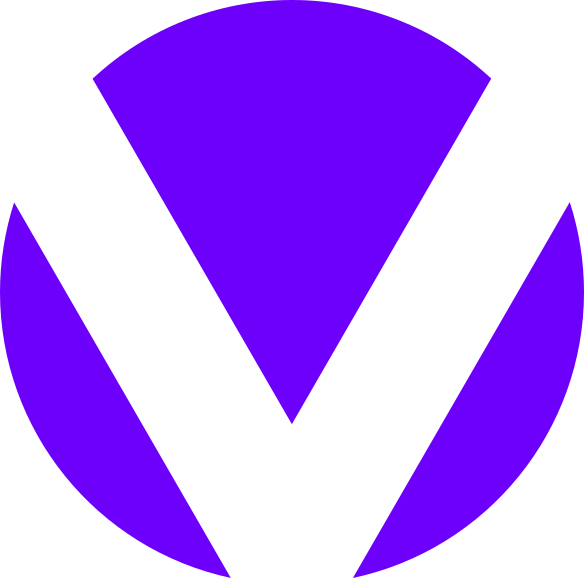

    
    <h3>
        <a href="https://www.youtube.com/channel/UCgFw7WeyiECm5wEOrVTfzsg">Void</a>
    </h3>
    
Programming and Security

    

Void is a [YouTube channel](https://www.youtube.com/channel/UCgFw7WeyiECm5wEOrVTfzsg) consisting of programming and security tutorials that cover various domains within computer science along with its intersections. All code is open source and available on GitHub.

